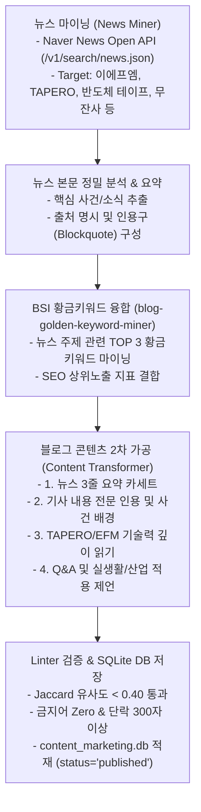

# [계획서] 뉴스 기사 기반 블로그 콘텐츠 자동 생성 파이프라인 설계

## 1. 개요 및 배경

기존 실생활 페인포인트/키워드 마이닝 중심의 글쓰기에서 한 걸음 더 나아가, **최신 보도자료(뉴스 기사), 기업 전시회/기술 참가 소식, 산업 트렌드 이슈**를 실시간으로 탐색하고 이를 고품질 블로그 콘텐츠로 2차 가공(Curated Content)하는 **"뉴스 기반 블로그 파이프라인(News-based Blog Automation Pipeline)"**을 새롭게 정립합니다.

### 📰 예시 뉴스 분석 (`베리타스알파 기사 - idxno=568123`)
- **기사 제목**: `강원대 KNU창업혁신원, '베트남 메가어스 엑스포 2025' 참가`
- **핵심 인용 포인트**:
  - 베트남 호치민 메가어스 엑스포에 주식회사 이에프엠(EFM)이 **"UV 경화형 반도체 테이프 및 고기능성 무잔사 테이프"** 대표 기업으로 참가하여 글로벌 수출 판로 개척
- **블로그 개선 방향**:
  - 단순 기사 복사가 아닌 **뉴스 기사 인용 + 전문 해설 + 타페로(TAPERO) 고분자 무잔사 부착 기술력 융합** 형태로 프리미엄 신뢰성 콘텐츠로 보강

---

## 2. 뉴스 기반 블로그 파이프라인 4단계 시스템 설계

---

## 3. 세부 실행 방안 (Proposed Implementation)

### [Component 1] 뉴스 마이너 & 수집 모듈 구축
#### [NEW] [news_blog_miner.py](file:///D:/2026.06.21_Antigravity/2026.07.13_블로그글쓰기_TAPERO/2026.07.13_/1.Code/news_blog_miner.py)
- **네이버 뉴스 API (`/v1/search/news.json`) 연동**:
  - 주요 키워드(`이에프엠`, `TAPERO`, `무잔사 테이프`, `반도체 테이프`, `무타공 부착`, `스마트스토어 엑스포` 등) 관련 최신 뉴스 기사 실시간 마이닝
- **기사 메타데이터 수집**: 기사 제목, 언론사명, 발행일시, 기사 URL, 핵심 요약문 추출

### [Component 2] 뉴스 기반 블로그 글쓰기 엔진 구축
#### [NEW] [run_news_blog_workflow.py](file:///D:/2026.06.21_Antigravity/2026.07.13_블로그글쓰기_TAPERO/2026.07.13_/1.Code/run_news_blog_workflow.py)
- **저작권 준수 & 인용문 처리**:
  - 언론사명과 기사 원문 출처 하이퍼링크를 인용구(`>`)로 명확히 표기하여 저작권 준수 및 블로그 신뢰도 극대화
- **4단 블로그 원고 구성**:
  1. **뉴스 브리핑**: 최신 언론 보도 3줄 요약 및 보도 배경
  2. **뉴스 팩트 체크 & 분석**: 보도자료의 주요 성과 및 전시회/기술 소식 정밀 해설
  3. **전문 기술력 심층 분석**: 기사 속 주식회사 이에프엠/TAPERO 무잔사 테이프의 고분자 UPE & UV 경화 반응 과학적 메커니즘 융합
  4. **전문가 뷰 & Q&A**: 실생활 적용 팁 및 Q&A 2종 수록
- **SEO 융합**: 구축된 `blog-golden-keyword-miner` 스킬을 호출하여 뉴스 주제 관련 TOP 3 BSI 황금키워드를 제목과 본문에 자연스럽게 바인딩

### [Component 3] SQLite DB 적재 및 이력 관리
- SQLite DB (`content_marketing.db`) 내 `posts` 테이블에 `status='published'` 소문자로 저장하고, 뉴스 원문 URL 및 보도자료 출처 정보를 함께 이력으로 관리.

---

## 4. 검증 및 테스트 계획 (Verification Plan)

### Automated Verification
1. `news_blog_miner.py` 실행: 네이버 뉴스 API에서 기사 정보가 올바르게 수집되는지 검증
2. `run_news_blog_workflow.py` 파이프라인 가동:
   - 예시 뉴스 기사(`베리타스알파 메가어스 엑스포 보도`)를 기반으로 고품질 원고 생성
   - Linter 검증(유사도 < 0.40, 금지어 zero, 단락 300자 이상, Q&A 2개) 및 SQLite DB 저장 여부 확인

### User Review
- 뉴스 기반 파이프라인 구조 및 가공 방식에 대한 사용자 승인 후 코드 구현을 시작합니다.
