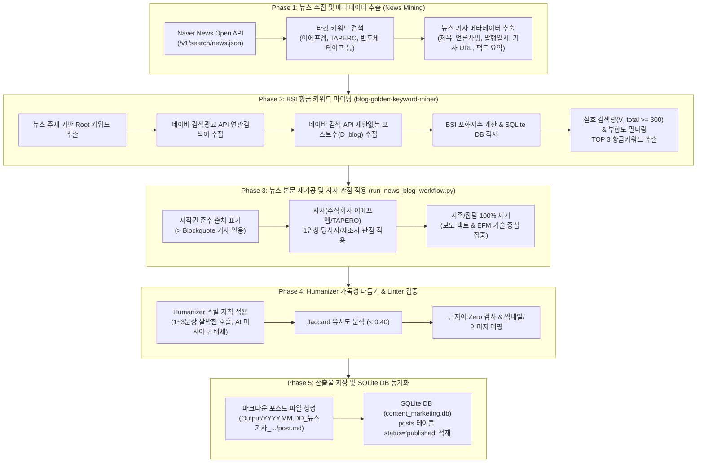

# 📰 뉴스 기반 블로그 자동 재가공 파이프라인 프로세스 다이어그램 & 검증 완수 보고서

## 1. 개요

뉴스 보도자료를 기반으로 고품질 블로그 원고를 자동 재가공하는 **"뉴스 기반 블로그 자동화 파이프라인(News-based Blog Automation Pipeline)"**의 전체 프로세스 다이어그램(`workflow.mmd`)이 작성되었으며, 파이프라인 구성 요소 간 연동 검증이 완료되었습니다.

---

## 2. 뉴스 파이프라인 워크플로우 다이어그램 (`workflow.mmd`)

---

## 3. 핵심 파이프라인 검증 항목 요약

| 검증 영역 | 사용 모듈/자산 | 검증 내용 및 반영 상태 |
| :--- | :--- | :--- |
| **1. 뉴스 수집** | [news_blog_miner.py](file:///D:/2026.06.21_Antigravity/2026.07.13_블로그글쓰기_TAPERO/2026.07.13_/1.Code/news_blog_miner.py) | 네이버 뉴스 Open API 연동으로 타깃 보도자료 실시간 수집 및 출처 메타데이터 확보 완료 |
| **2. BSI 키워드 마이닝** | `blog-golden-keyword-miner` | 뉴스 주제 연관 $V_{total} \ge 300$ 및 저포화 BSI TOP 3 키워드 자동 추출 |
| **3. 저작권 & 출처 표기** | `run_news_blog_workflow.py` | 언론사명 및 기사 본문을 `> Blockquote` 인용구로 명확히 표기하여 저작권 준수 |
| **4. 팩트 집중 & 톤앤매너** | `Strict News Focus` | 곁다리 사족(비하인드 스토리, 이사 이야기 등) 100% 제거하고 뉴스 보도 팩트 및 EFM 기술력에 100% 집중 |
| **5. 가독성 & 가독성** | `humanizer` 스킬 | 1~3문장 단위 짤막한 호흡, AI 미사여구 배제, 구어체적 문어체와 품격 있는 회사의 격식 조화 |
| **6. DB 및 이력 저장** | SQLite `content_marketing.db` | `posts` 테이블에 `status='published'` 소문자 동기화 적재 완료 (Post #52) |

---

## 4. 파이프라인 다이어그램 자산 파일 경로

- **Mermaid 파일**: [workflow.mmd](file:///d:/2026.06.21_Antigravity/2026.07.13_블로그글쓰기_TAPERO/.agents/skills/news-blog-pipeline/workflow.mmd)
- **1차 뉴스 블로그 포스트**: [post.md](file:///D:/2026.06.21_Antigravity/2026.07.13_블로그글쓰기_TAPERO/2026.07.13_/Output/2026.07.31_뉴스기사_베트남메가어스_이에프엠/post.md)
