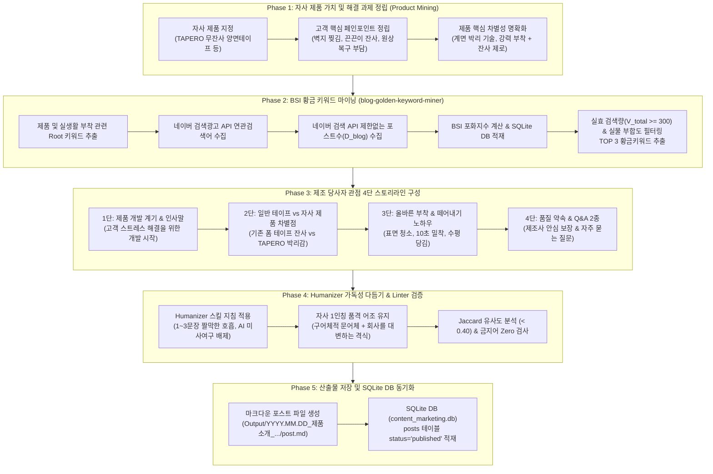

# 🛍️ 일반 자사 제품 소개 글쓰기 파이프라인 프로세스 다이어그램 & 가이드 완수 보고서

## 1. 개요

자사 제품(타페로 무잔사 양면테이프 등)의 개발 계기, 핵심 차별점, 사용 노하우 및 제조사의 진심을 1인칭 제조 당사자 관점(Owner Voice)으로 전달하는 **"일반 자사 제품 소개 글쓰기 파이프라인(Standard Company Product Pipeline)"**의 전체 프로세스 다이어그램(`workflow.mmd`) 작성이 완수되었습니다.

---

## 2. 제품 소개 파이프라인 워크플로우 다이어그램 (`workflow.mmd`)

---

## 3. 핵심 파이프라인 구성 요소 요약

1. **Phase 1: 자사 제품 가치 및 해결 과제 정립**:
   - 기존 테이프 사용 시 고객이 겪는 페인포인트(벽지 찢김, 끈끈이 잔사, 원상복구 부담)와 자사 제품의 해결책(무잔사 계면 박리 기술)을 명확히 정의.
2. **Phase 2: BSI 황금 키워드 마이닝**:
   - `blog-golden-keyword-miner` 스킬을 활용하여 실생활 부착 문제 연관 $V_{total} \ge 300$ 및 저포화 BSI TOP 3 황금키워드 자동 추출.
3. **Phase 3: 제조 당사자 관점 4단 스토리라인**:
   - 주식회사 이에프엠(TAPERO) 1인칭 제조사/개발자 관점(Owner Voice) 적용.
   - 개발 계기 -> 제품 차별성 -> 올바른 부착/박리 노하우 -> 품질 약속 & Q&A 2종 스토리라인.
4. **Phase 4: Humanizer 가독성 다듬기 & Linter 검증**:
   - `humanizer` 스킬 준수 (1~3문장 짤막한 호흡, AI 특유 미사여구 배제, 다정하면서도 품격 있는 자사 구어체 문어체).
   - Jaccard 유사도 (< 0.40), 금지어 Zero, 단락 글자수 검증.
5. **Phase 5: 산출물 저장 및 SQLite DB 동기화**:
   - 마크다운 파일 저장 및 SQLite DB (`content_marketing.db`) 내 `status='published'` 소문자 동기화 등록.

---

## 4. 자산 파일 경로

- **Mermaid 파일 자산**: [workflow.mmd](file:///d:/2026.06.21_Antigravity/2026.07.13_블로그글쓰기_TAPERO/.agents/skills/standard-product-pipeline/workflow.mmd)
