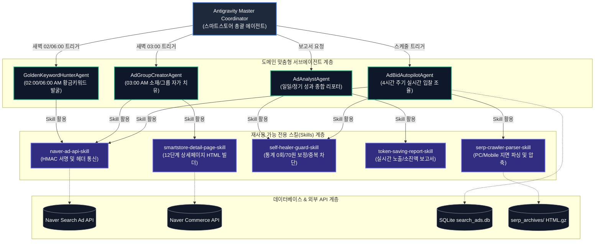

# 네이버 스마트스토어 & 검색광고 맞춤형 에이전트 및 스킬 아키텍처 보고서

본 보고서는 `D:\2026.07.16_스마트스토어` 프로젝트에 구현된 비즈니스 로직과 자동화 파이프라인을 **네이버 쇼핑/검색광고 전용 맞춤형 서브에이전트(Subagents) 및 스킬(Skills) 아키텍처**로 재설계한 전용 아키텍처 명세서입니다.

---

## 1. 전용 아키텍처 다이어그램 (Mermaid Diagram)



---

## 2. 맞춤형 서브에이전트(Custom Subagents) 명세

| 서브에이전트 명 | 스케줄 및 역할 (Schedule & Role) | 주요 수행 작업 및 자가 치유 기능 |
| :--- | :--- | :--- |
| **`AdBidAutopilotAgent`** | **10/14/18/22시 정기 실행**<br/>실시간 입찰가 최적화 | - PC/Mobile 지면 독립 크롤링 및 통합 순위(`decision_rank`) 산출<br/>- Estimate-First Smart Gating (250원 초과 스킵)<br/>- 200원 예산 한도 내 입찰가 조율 (1~2위 10원 인하, 8위 이하 인상) |
| **`AdGroupCreatorAgent`** | **매일 03:00 AM 실행**<br/>광고그룹 및 소재 자가 치유 | - 파워링크 9개 + 쇼핑검색 3개 광고그룹 개수 자동 제어 (최대 12개 한도)<br/>- Catch Phrase 소재 헤드라인 15자 규격 검증 및 랜딩 URL 통일<br/>- 이관 키워드 정리 복구 |
| **`GoldenKeywordHunterAgent`** | **매일 02:00 / 06:00 AM 실행**<br/>저비용 고효율 키워드 발굴 | - 네이버 연관키워드 API 타겟팅 수집<br/>- 200원 한도 초과 시드(`expensive_seeds`) 기반 대안 롱테일 키워드 검색<br/>- 경쟁도 대비 클릭당 비용이 적은 황금 키워드 자동 등록 |
| **`AdAnalystAgent`** | **매일 02:00 AM 및 정기 작성**<br/>통합 리포팅 및 지표 동기화 | - 실시간 네이버 API `/stats` 성과 동기화 및 DB 백업 2차 복구<br/>- 실시간 노출 키워드 목록전수 및 소진액 대시보드 표기<br/>- 토큰 절약형 자동 보고서 생성 |

---

## 3. 맞춤형 전용 스킬(Custom Skills) 구성 설계

프로젝트 내 중복 코드를 방지하고 타 파이프라인에서 재사용할 수 있도록 `.agents/skills/` 폴더 하위에 패키징할 5대 전용 스킬 명세입니다:

```
.agents/skills/
├── naver-ad-api-skill/              # [스킬 1] 네이버 검색광고 API 인증 및 통신 스킬
│   ├── SKILL.md
│   └── scripts/naver_api.py
├── serp-crawler-parser-skill/       # [스킬 2] PC/Mobile SERP 크롤링 및 파싱 스킬
│   ├── SKILL.md
│   └── scripts/serp_parser.py
├── self-healer-guard-skill/         # [스킬 3] 통계 0회/70원 보정/중복 차단 자가 치유 스킬
│   ├── SKILL.md
│   └── scripts/self_healer.py
├── token-saving-report-skill/       # [스킬 4] 토큰 절약형 정기 보고서 자동 생성 스킬
│   ├── SKILL.md
│   └── scripts/generate_report.py
└── smartstore-detail-page-skill/   # [스킬 5] 12단계 상세페이지 HTML/이미지 빌드 스킬
    ├── SKILL.md
    └── references/layout_spec.md
```

### 각 스킬의 핵심 기능
1.  **`naver-ad-api-skill`**: HMAC SHA256 서명 생성 및 네이버 검색광고 API REST 요청 단일화.
2.  **`serp-crawler-parser-skill`**: 네이버 검색 지면의 파워링크 광고 위치, 광고수, 경쟁사 URL 파싱 및 `.html.gz` 압축 백업.
3.  **`self-healer-guard-skill`**: 통계 API 400 에러 시 DB 백업 수치 전환, Estimate 70원 착오 시 90~100원 보정, 25분 이내 중복 크롤링 100% 차단.
4.  **`token-saving-report-skill`**: 실시간 노출 키워드 전수 및 성과 지표 표를 대시보드화하여 토큰 소모를 최소화하는 보고서 작성.
5.  **`smartstore-detail-page-skill`**: 스마트스토어 행동 규약(AGENTS.md)에 지정된 12단계 표준 상세페이지 HTML 및 프레임 이미지 빌드.

---

## 4. 기존 구조 대비 전환 이점

1.  **완전한 분업화**: 입찰 조율(`AdBidAutopilotAgent`), 그룹 관리(`AdGroupCreatorAgent`), 키워드 발굴(`GoldenKeywordHunterAgent`), 분석(`AdAnalystAgent`)이 독립된 세션에서 작동하므로 맥락 간섭(Context Interference)이 없습니다.
2.  **스킬 재사용성 (Modular Reusability)**: 네이버 API 통신, SERP 파싱, 자가 치유 모듈이 독립 스킬로 패키징되어 추후 새로운 상품이나 쇼핑검색 파이프라인 확장 시 코드 중복 없이 바로 호출할 수 있습니다.
3.  **유지보수 편의성**: 기능 수정 시 관련 스킬(`SKILL.md`)만 업데이트하면 모든 에이전트에 일괄 적용됩니다.
